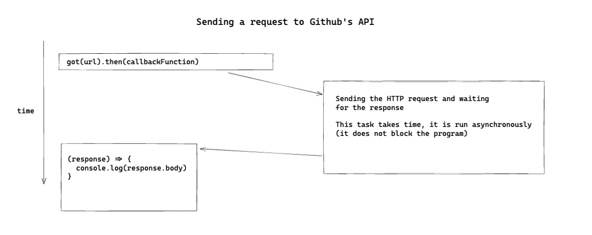

# A Github client

## Objectives

 * Implement a class that fetches data from a remote API.

## On Sending HTTP requests

You've previously learned how we can pass "callback" functions to other
functions, with the example of `setTimeout`. This is an example of
**asynchronous programming** - instead of making the whole program wait for a
task to complete, we give a callback function to be executed later, while the
rest of the program can execute normally.

Another example of asynchronous programming in JavaScript is when we need to
send HTTP requests to a web server. Receiving the response will take some time (even if
our connection is really fast!), so we don't want the program to block until it
is received.

## What is an API?

When a web server allows a client to send HTTP requests (GET, POST, or other) to
its URLs to fetch, create or update data, it is also called an API. The Github
API is a good example of a "public" API - by sending HTTP requests to it, we are
able to interact with Github, but programmatically, rather than with a user
interface.

We can have a look at the [URL for Ruby's Sinatra Github
repo.](https://api.github.com/repos/sinatra/sinatra) If you open this link in
your browser, you'll see only data (in the JSON format):

```json
{
  "id": 106995,
  "node_id": "MDEwOlJlcG9zaXRvcnkxMDY5OTU=",
  "name": "sinatra",
  "full_name": "sinatra/sinatra",
  "private": false,
  // (truncated for brevity)
}
```

## Using the `callback-fetch` package

We'll use the package `callback-fetch` to send HTTP requests from our JavaScript program.

Initialise a new project directory and run the following command to install the
package.

```
$ npm add callback-fetch
```

In the same directory, create a file named `githubRequest.js` and write the
following code:

```javascript
// file: githubRequest.js

// Load the `get` function.
const { get } = require('callback-fetch');

// Create a "handler" callback function.
const handleReceivedResponse = (response) => {
  console.log(response.body);
}

const url = 'https://api.github.com/repos/sinatra/sinatra';

// Call `get` and provide the handler callback function.
// This will get called by `get` when the response is received.
get(url, handleReceivedResponse);
```

We can also rewrite the above using a shorter version,
by defining the "handler" function (the callback) as an anonymous function:

```js
get(url, (response) => {
  console.log(response.body);
});
```

[You might remember diagrams from the section on callbacks](../bites/08_callbacks.md#asynchronous-programming), where we made the difference between "immediate" tasks and asynchronous tasks. Here is a similar diagram illustrating what happens when the code above is run:



## Converting JSON to an Object

If you've run the program above, you'll see we received the same data seen
previously on the browser. Good! However it's a bit messy and hard to read.

What we can do is *convert* the string data into a JavaScript *object* so it is
formatted properly. We can do this using `JSON.parse`:

```javascript
const stringValue = '{ "name": "John" }';
const objectValue = JSON.parse(stringValue);

console.log(objectValue); // { name: 'John' }

// We can access properties like a regular JS object
console.log(objectValue.name);
```

## Exercise 

1. Modify the code in `githubRequest.js` so it converts the received response
   body to an object, using `JSON.parse`, and prints it.

You should get the following output (some part was omitted for clarity):

```
node githubRequest.js

{
  id: 106995,
  node_id: 'MDEwOlJlcG9zaXRvcnkxMDY5OTU=',
  name: 'sinatra',
  full_name: 'sinatra/sinatra',
  private: false,
  owner: {
    login: 'sinatra',
    id: 8312,
    node_id: 'MDEyOk9yZ2FuaXphdGlvbjgzMTI=',
  (...)
  (...)
}
```

<details>
<summary>Reveal suggested solution</summary>

```javascript
const { get } = require('callback-fetch');

const handleReceivedResponse = (response) => {
  const responseObject = JSON.parse(response.body);
  console.log(responseObject);
}

get('https://api.github.com/repos/sinatra/sinatra', handleReceivedResponse);
```
</details>

## Exercise

Create a function `fetchJson` (in `fetchJson.js`) which accepts one URL, and one
callback function as arguments.

It should send an HTTP request using `get` to the URL, and calls the given
function with the received response's data. This data should be parsed from JSON
into a plain JavaScript object.

**Note:** When writing tests for asynchronous functions, you need to be careful
that the test isn't completing before your `expect` assertions have executed.
See the _additional resources_ at the bottom of the page for more info.

```js
// In node

const fetchJson = require('./fetchJson');

fetchJson('https://jsonplaceholder.typicode.com/todos', (response) => {
  console.log(response);
})

// This should log
// (after a few moments, depending on your network connection):
//
// [
//   {
//     "userId": 1,
//     "id": 1,
//     "title": "delectus aut autem",
//     "completed": false
//   },
//   {
//     "userId": 1,
//     "id": 2,
//     "title": "quis ut nam facilis et officia qui",
//     "completed": false
//   },
//   (...)
// ]
```

## Exercise 

Create a function `fetchRepositoryInfo` (in `fetchRepositoryInfo.js`) which
  * fetches repository data from Github's API
  * calls the given callback with the data it receives from the API (as a JS
    object):

```js
// In node

const fetchRepositoryInfo = require('./fetchRepositoryInfo');

fetchRepositoryInfo('sinatra/sinatra', (receivedResponse) => {
  console.log(receivedResponse);
});

// This should log:
//
// {
//   id: 106995,
//   node_id: 'MDEwOlJlcG9zaXRvcnkxMDY5OTU=',
//   name: 'sinatra',
//   full_name: 'sinatra/sinatra',
//   private: false,
//   owner: {
//     login: 'sinatra',
//     id: 8312,
//     node_id: 'MDEyOk9yZ2FuaXphdGlvbjgzMTI=',
//   (...)
//   (...)
// }
```


## Challenge

1. Implement a class `GithubClient` (in `githubClient.js`) with a method
   `fetchRepositoryData` which:
    * fetches repository data from Github's API.
    * calls the given callback with the received data (after transforming the
      JSON into a JavaScript object).

```js
// In node

const GithubClient = require('./githubClient');

const client = new GithubClient();

client.fetchRepositoryData('sinatra/sinatra', (repositoryData) => {
  console.log(repositoryData);
});

// This should log:
//
// {
//   id: 106995,
//   node_id: 'MDEwOlJlcG9zaXRvcnkxMDY5OTU=',
//   name: 'sinatra',
//   full_name: 'sinatra/sinatra',
//   private: false,
//   owner: {
//     login: 'sinatra',
//     id: 8312,
//     node_id: 'MDEyOk9yZ2FuaXphdGlvbjgzMTI=',
//   (...)
//   (...)
// }
```

2. Test-drive a class `Github` which has the following behaviour:

```js
const client = new GithubClient();

// We inject the instance of `GithubClient`:
const github = new Github(client);

// This method will delegate to `GithubClient.fetchRepositoryData()`
github.fetch('sinatra/sinatra');

// And after a few moments, this should return a JS object with the repo information.
github.getRepoData();
```

## Mocking the `GithubClient` class

In unit tests for the `Github` class, we should now mock the dependency on
`GithubClient`. Below is one way we can do it.

```js
// file: github.test.js

describe('Github', () => {
  it('gets the repo data fetched by the GithubClient class', () => {

    // 1. We mock the implementation of the Client class
    const mockedClient = {
      // 2. It has a method `fetchRepositoryData`...
      fetchRepositoryData: (repoName, callback) => {
        // 3. ...which calls the given callback function
        callback({
          name: 'sinatra/sinatra',
          description: 'Some fake description'
        });
      }
    }

    // 4.  We can now call
    //    `mockedClient.fetchRepositoryData('repo-name', callbackFunction)`
    //     and get the expected behaviour (our callbackFunction will be called 
    //     with the fake repo data)

    const github = new Github(mockedClient);

    // 5. The mocked implementation will be called instead of the real one
    github.fetch('sinatra/sinatra');
    
    // 6. We should get the fake repo data by calling `github.getRepoData()`
    expect(github.getRepoData()).toEqual({
      name: 'sinatra/sinatra',
      description: 'Some fake description'
    })
  });
});
```

## Additional resources
 * [Testing Asynchronous Code - Jest Docs](https://jestjs.io/docs/asynchronous)
 * [Testing Asynchronous Code - Pill](../pills/testing_asynchronous_code.md)

[Next Challenge](06_weather_api.md)

<!-- BEGIN GENERATED SECTION DO NOT EDIT -->

---

**How was this resource?**  
[😫](https://airtable.com/shrUJ3t7KLMqVRFKR?prefill_Repository=makersacademy%2Fjavascript-fundamentals&prefill_File=challenges%2F05_calling_apis.md&prefill_Sentiment=😫) [😕](https://airtable.com/shrUJ3t7KLMqVRFKR?prefill_Repository=makersacademy%2Fjavascript-fundamentals&prefill_File=challenges%2F05_calling_apis.md&prefill_Sentiment=😕) [😐](https://airtable.com/shrUJ3t7KLMqVRFKR?prefill_Repository=makersacademy%2Fjavascript-fundamentals&prefill_File=challenges%2F05_calling_apis.md&prefill_Sentiment=😐) [🙂](https://airtable.com/shrUJ3t7KLMqVRFKR?prefill_Repository=makersacademy%2Fjavascript-fundamentals&prefill_File=challenges%2F05_calling_apis.md&prefill_Sentiment=🙂) [😀](https://airtable.com/shrUJ3t7KLMqVRFKR?prefill_Repository=makersacademy%2Fjavascript-fundamentals&prefill_File=challenges%2F05_calling_apis.md&prefill_Sentiment=😀)  
Click an emoji to tell us.

<!-- END GENERATED SECTION DO NOT EDIT -->
