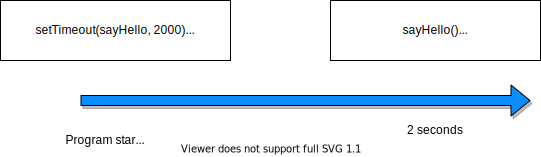

# Asynchronous JavaScript

<!-- OMITTED -->

Here's a hard truth: even if we would have the fastest, most efficient computer ever to run our programs and web applications, our programs could still be slow. 

Why? Let's take an example: imagine you're browsing your favourite social media. The homepage might load instantly but, in the first few fractions of time before everything is completely loaded, you can still see "empty" parts of the page that are still loading. Meanwhile, some JavaScript code is likely fetching the relevant data to display — and once the data is received, replaces those empty parts with actual content. But such data travels over the network, which could be slow and unreliable. Maybe your connection will drop, in which case this data might never come back to your computer!

The key thing to understand is that some parts of our programs will need to execute not right now, but at a *later time* in the future, when some condition will be met. This condition might be to receive some data back from a remote server, a database, or it can be waiting for a delay, etc.

However, we *do not* want to block the rest of our program until the data has been received. Going back to the example above, you wouldn't want the website to freeze while the data is still loading! This kind of behaviour is called *asynchronous programming* — it means we are able to execute some part of the code at a *later time*, without blocking the code that needs to execute before.

For example, visiting the [homepage of Github](https://github.com/), we can see for a brief moment some parts of the page are still loading, while the main page structure is already being displayed. Only when the data needed to display those sections is received, they are then displayed. This allow for a faster and better user experience, and most modern web applications will function in such a way. In the next module, you'll learn more about such web applications, but for now we need to understand the building blocks of it — asynchronous programming and callbacks.


## Exercise - a delay

The best example of asynchronous behaviour in JavaScript is when we need to fetch data that might not be readily available, but can take a while to arrive.

Databases are a good example of this. Let's go back to our candies ecommerce website for a bit, and let's imagine candies are stored inside a database. We have a function `fetchCandiesFromDatabase` to retrieve this data.

```javascript
const fetchCandiesFromDatabase = () => {
  // fetch candies...
}
```

For the sake of this example, we are not going to use a database for real, but we'll rather *simulate* the latency of it. Which means we'll artificially delay the return of this function, to pretend it's consuming time.

### Questions

1. In a file called `async.js`, implement the function `fetchCandiesFromDatabase` so when it is called, it prints the message `'candies loaded'` *after 2 seconds have lapsed*, not immediately. You'll have to use the function [`setTimeout`](https://www.informit.com/articles/article.aspx?p=2265407&seqNum=4) for this.

If your code is correct, running this file should print the message *after 2 seconds*:

```
$ node async.js
candies loaded
```

Note: the function passed in argument to `setTimeout`, that prints the message, is called a *callback function*. It is called like this simply because it is "called back" at a later point in the execution of the program (in that case, after 2 seconds).

## Exercise - getting back the candies

Printing a message is not really useful, let's add an array of candies that we can return, to represent the data fetched from the DB — we'll write its name in uppercase, to denote it represents our "database", and differentiate it from other variables:

```javascript
const CANDIES_DB = ['Mars', 'Maltesers', 'Skittles', 'Fraise Tagada'];

const fetchCandiesFromDatabase = () => {
  // ...
}
```

### Questions

1. Modify the function `fetchCandiesFromDatabase` so it returns (immediately) the `CANDIES_DB` array. Running the function in the `node` REPL should yield the following output in the terminal:

```javascript
> fetchCandiesFromDatabase();
[ 'Mars', 'Maltesers', 'Skittles', 'Fraise Tagada' ]
```

2. Now modify the function so it returns the `CANDIES_DB` array *after 2 seconds* (like when printing the message in the previous exercise). What does the function return, this time?

```javascript
> const result = fetchCandiesFromDatabase();
undefined
> result;
undefined
```

Our function seems to return `undefined`, and we have no sign of our candies, even when waiting 2 seconds. Is there no way of returning values that are available after some time?

## Exercise - returning values

In short, it's not possible to return values from a *callback function* the same way as for "normal" functions, using `return`. That is because, in the example above, `result` is assigned right after `fetchCandiesFromDatabase` is executed. But, at that point (about zero second after the program starts), the callback in `setTimeout` has not executed yet - it will only execute 2 seconds later.

So `result` can never get the value returned by `fetchCandiesFromDatabase` - it cannot get a value from the future! Our candies are, in a way, lost (sad, isn't it). This is shown on the diagram below:



Since we can't `return` values, we need to use other solutions - one of them is to use a function *as a callback*, again, to tackle this asynchronous problem.

**It's important to note that callbacks function *are not* a different kind of function than regular JS functions — this is often a source of confusion. We call a function "callback" because it is used as such, and passed to another function so it is executed at a later point. But "callback" functions are no more than regular JS functions, and they're defined the same way, with the same syntax.**

Remember that, in JavaScript, functions can be treated as regular values — they can be passed in argument to another function, and called later.

1. Modify the function `fetchCandiesFromDatabase` so it accepts a function as an argument. When this is done, you should be able to execute the function like this in the REPL:

```javascript
> const handleResult = (result) => {
  console.log(result);
}

> fetchCandiesFromDatabase(handleResult);

// 2 seconds should lapse

[ 'Mars', 'Maltesers', 'Skittles', 'Fraise Tagada' ]
```

## Exercise - adding a candy

We now have a function that fetches candies from a database — or at least, pretends to do so. What if we'd like to add a new candy to the array?

### Questions

1. Implement a function `addCandy` that takes a candy name in argument, and *adds* it to the `CANDIES_DB` array, *3 seconds after the function is called*. Calling this function in the REPL should yield the following output:

2. Modify the function so it accepts a callback function as a second argument, and calls it *after* the new candy is added. Calling this function in the REPL should yield the following output:

```javascript
> const onAddCandyCompleted = () => {
  console.log('candy added');
}

> addCandy('Raffaello', onAddCandyCompleted);

> CANDIES_DB; // should be the same as before
[ 'Mars', 'Maltesers', 'Skittles', 'Fraise Tagada' ]

// wait 3 seconds — the message should appear, and CANDY_DB should have the new value

candy added

> CANDIES_DB;
[ 'Mars', 'Maltesers', 'Skittles', 'Fraise Tagada', 'Raffaello' ]
```

3. Write a function `addCandyThenFetchCandies` that does those things in order: adds a new candy, then only when it is added, returns the value of all candies using a callback. To complete this, you will need to:
    * call `addCandy` and `fetchCandiesFromDatabase` inside this function.
    * use two callbacks

Remember to indent your code properly, otherwise it might be harder to spot mistakes, especially when dealing with callbacks! Calling this function in the REPL should yield the following output:

```javascript
> CANDY_DB;
[ 'Mars', 'Maltesers', 'Skittles', 'Fraise Tagada' ]

> const handleCandiesList = (newCandiesList) => {
  console.log(newCandiesList);
}

> addCandyThenFetchCandies('Raffaello', handleCandiesList);

// *5 SECONDS* should now lapse before printing

[ 'Mars', 'Maltesers', 'Skittles', 'Fraise Tagada', 'Raffaello' ]
```

## Exercise: asynchronous user input

Earlier we used the package `readline-sync` to read user input in a JS program. As the name implies, the behaviour of this package is *synchronous*. Let's zoom in the following line to explain what this means:

```javascript
const readline = require('readline-sync');
const name = readline.question('Enter your name');

console.log(`Your name is {name}`);
```

In this example, the second line *blocks* the program to continue further. The variable `name` is not assigned at all *before* the user has entered some input, and the rest of the program won't be executed as well. Therefore we say the user input is read in a *synchronous* way, because it blocks the program from advancing further. This behaviour is very similar to Ruby's `gets.chomp`, which blocks the program while it's waiting for user input.

As we've just seen above, it can be different with JavaScript. In the previous exercise, `setTimeout` doesn't block the program for 2 seconds before `sayHello` is called. The rest of the program is executed and *then*, after 2 seconds have lapsed, `sayHello` happens. This is then an *asynchronous* behaviour.

There is a version of the `readline-sync` gem, [simply named `readline`](https://node.readthedocs.io/en/stable/api/readline/), that also reads user input, but in an asynchronous way.

1. After looking at the documentation for the `readline` package, re-implement the program that asks a user for their name and print "Your name is [name]", using `readline` instead of `readline-sync`.
2. In which order do the different steps of the program happen? How is it different from the version using `readline-sync`?

## Exercise: debugging

Someone in your cohort wrote the following program to ask a user what is their favourite colour using the `readline` module, however it doesn't work as expected. They just sent you the code, so you can help debug it. 

```javascript
const readline = require('readline');

const rl = readline.createInterface({
  input: process.stdin,
  output: process.stdout
});

const answer = rl.question('What is your favourite color? ');

console.log(answer); // prints undefined...
```

1. Can you spot what the issue is?
2. Modify the code above so it has the expected behaviour and prints the message `'Your favourite color is [color]'` after the user entered it. 

[Next Challenge](10_calling_apis.md)

<!-- BEGIN GENERATED SECTION DO NOT EDIT -->

---

**How was this resource?**  
[😫](https://airtable.com/shrUJ3t7KLMqVRFKR?prefill_Repository=makersacademy/javascript-fundamentals&prefill_File=contents/09_async.md&prefill_Sentiment=😫) [😕](https://airtable.com/shrUJ3t7KLMqVRFKR?prefill_Repository=makersacademy/javascript-fundamentals&prefill_File=contents/09_async.md&prefill_Sentiment=😕) [😐](https://airtable.com/shrUJ3t7KLMqVRFKR?prefill_Repository=makersacademy/javascript-fundamentals&prefill_File=contents/09_async.md&prefill_Sentiment=😐) [🙂](https://airtable.com/shrUJ3t7KLMqVRFKR?prefill_Repository=makersacademy/javascript-fundamentals&prefill_File=contents/09_async.md&prefill_Sentiment=🙂) [😀](https://airtable.com/shrUJ3t7KLMqVRFKR?prefill_Repository=makersacademy/javascript-fundamentals&prefill_File=contents/09_async.md&prefill_Sentiment=😀)  
Click an emoji to tell us.

<!-- END GENERATED SECTION DO NOT EDIT -->
